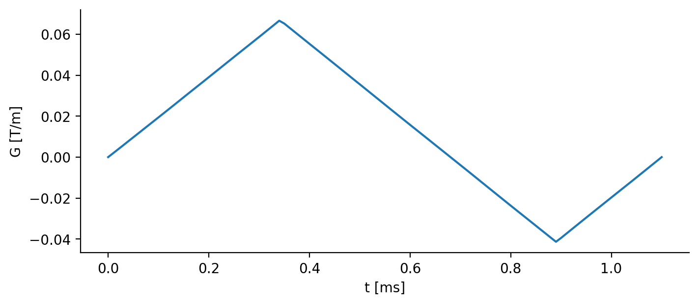

GrOpt is a toolbox for MRI Gradient Optimization (GrOpT). Rather than analytical combinations of trapezoids, the software uses optimization methods to generate arbitrary waveforms that are (hopefully) the most time optimal solution.

The main workhorse of the package are the optimization routines written in C++, which for final applications are designed to be compiled into a pulse sequence as needed. 

## Installation

```bash
pip install --pre gropt
```

!!! note
    GrOpt 2.0 is currently in pre-release. The `--pre` flag is required for now — an official release is coming shortly.

## Quick Start

```python
import gropt
```

In this example we generate a flow compensated phase encode, with a known duration (1.12 ms).

``` py
gparams = gropt.GroptParams()

# Set up problem
gparams.dt = 10e-6
gparams.N = 112
gparams.vec_init_simple()

# Add constraints
gparams.add_gmax(.08)
gparams.add_smax(200)
gparams.add_moment(0,14.0)
gparams.add_moment(1,0.0)

# Solve
gparams.solve()
out = gparams.get_out()
```

Which produces the waveform:



## Next Steps

- [Python API Reference](python/gropt_py.md) — full documentation of the Python wrapper
- [Examples](examples/) — Jupyter notebooks demonstrating common use cases
